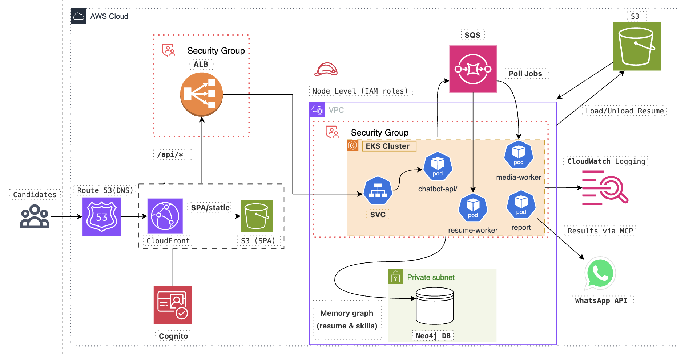
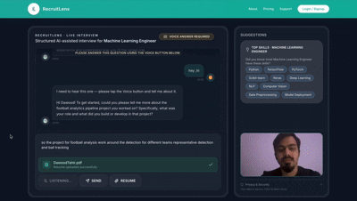

# RecruitBot

[]()
[]()


About
-----
Recruitlens is a recruitment chatbot that works in a hybrid chat and video stream input from the candidate to anaylze his skills across the job description he is being interviewed for. The confidence in voice while speaking, sentiment analysis through the video input and clarity in the answers all play the role in deciding the standing of the candidate for the specified job. At the end the report is sent to hiring manager's whatsapp through MCP

Built for researchers and engineers who want reproducible experiments and deployable results.


Table of contents
------------------

- About
- Table of contents
- Architecture Diagram
- Results Overview
- Installation (dev)
- Running (Docker)
- Example usage (Python & API)
- Citation & license
- Contact

---


## Architecture




## Results Overview 


<p align="center">
  
</p>

## Implementation

This section explains how to containerize the API (using `Dockerfile.api`), create a local k3s cluster with `k3d`, run a Neo4j database inside the cluster, deploy your API image into the cluster, and securely pass AWS credentials into the running workload. Follow the steps below exactly (replace placeholder values where indicated).

> **Prerequisites**
> - Docker installed and running
> - kubectl installed and configured (kubectl >= 1.20)
> - k3d installed (for local testing)

---

### 1) Build the Docker image from `Dockerfile.api`

```bash
docker build -t chatbot-api:local -f Dockerfile.api .
```

(Optional:  
To use a remote registry, tag and push:
```bash
docker tag chatbot-api:local <your-dockerhub-username>/chatbot-api:latest
docker push <your-dockerhub-username>/chatbot-api:latest
```
)

---

### 2) Install & Verify k3d

```bash
curl -s https://raw.githubusercontent.com/k3d-io/k3d/main/install.sh | bash
# or: brew install k3d
k3d version
```

---

### 3) Create a k3d cluster

```bash
k3d cluster create mcp-cluster --agents 1
k3d image import chatbot-api:local --cluster mcp-cluster
kubectl cluster-info
```

---

### 4) Deploy Neo4j inside the cluster

Create `k8s/neo4j-deployment.yaml`:

```yaml
apiVersion: apps/v1
kind: Deployment
metadata:
  name: neo4j
  labels:
    app: neo4j
spec:
  replicas: 1
  selector:
    matchLabels:
      app: neo4j
  template:
    metadata:
      labels:
        app: neo4j
    spec:
      containers:
      - name: neo4j
        image: neo4j:4.4
        env:
        - name: NEO4J_AUTH
          value: "neo4j/ChangeMe123!"
        ports:
        - containerPort: 7474
        - containerPort: 7687
        volumeMounts:
        - name: neo4j-data
          mountPath: /data
      volumes:
      - name: neo4j-data
        emptyDir: {}
---
apiVersion: v1
kind: Service
metadata:
  name: neo4j
spec:
  selector:
    app: neo4j
  ports:
  - name: http
    port: 7474
    targetPort: 7474
  - name: bolt
    port: 7687
    targetPort: 7687
  type: ClusterIP
```

```bash
kubectl apply -f k8s/neo4j-deployment.yaml
kubectl rollout status deployment/neo4j
```

---


### 5) Deploy API to K8s

Example `k8s/api-deployment.yaml`:

```yaml
apiVersion: apps/v1
kind: Deployment
metadata:
  name: mcp-api
  namespace: mcp
  labels:
    app: mcp-api
spec:
  replicas: 1
  selector:
    matchLabels:
      app: mcp-api
  template:
    metadata:
      labels:
        app: mcp-api
    spec:
      serviceAccountName: mcp-api-sa
      containers:
        - name: mcp-api
          image: chatbot-api:local      # Or your remote image tag
          ports:
            - containerPort: 8080
          envFrom:
            - secretRef:
                name: openai-secret
            - secretRef:
                name: neo4j-creds
            - secretRef:
                name: aws-creds
            - secretRef:
                name: whatsapp-secret
            - configMapRef:
                name: app-config
---

apiVersion: v1
kind: Service
metadata:
  name: mcp-api
  namespace: mcp
spec:
  selector:
    app: mcp-api
  ports:
    - protocol: TCP
      port: 8080
      targetPort: 8080
  type: ClusterIP
```
### 4. Deploy the API to the Kubernetes cluster

Once the Docker image has been built and imported into the k3d/EKS cluster, apply the
Kubernetes manifests to create or update the API deployment and service:

```bash
kubectl apply -f k8s/api-deployment.yaml
```
This:

- Creates/updates the `mcp-api` (chatbot API) `Deployment` and `Service`.
- Ensures the desired number of pods are running with the latest image and env config.

After applying, wait for the new pods to roll out successfully:
```bash
kubectl rollout status deployment/mcp-api
```
This blocks until the deployment is **ready** (all replicas up and healthy) or reports a
failure, so you know the new version is live in the cluster before you start testing it.
---
##  WhatsApp API Setup (REQUIRED BEFORE START)

Before proceeding, you must configure access to the WhatsApp API integration for MCP-Chatbot to send and receive messages.  
**The following variables are required:**

| Variable              | Description                                                  |
|-----------------------|--------------------------------------------------------------|
| `WHATSAPP_TOKEN`      | WhatsApp API access token from your WhatsApp provider (e.g., Meta Cloud API or Twilio) |
| `WHATSAPP_PHONE_ID`   | WhatsApp phone number ID or business account ID              |

- Obtain these credentials from your WhatsApp Business API provider (e.g., [Meta](https://developers.facebook.com/docs/whatsapp/cloud-api/get-started), Twilio, etc.).
- **These variables must be stored in your Kubernetes cluster as secrets** for production deployments.
- Your application expects these variables to be accessible as environment variables.

**Example setup (see below for Kubernetes secret instructions):**
```bash
kubectl -n mcp create secret generic whatsapp-secret \
  --from-literal=WHATSAPP_TOKEN='<YOUR_WHATSAPP_TOKEN>' \
  --from-literal=WHATSAPP_PHONE_ID='<YOUR_WHATSAPP_PHONE_ID>'
### 6) Test/Debug

```bash
kubectl port-forward svc/neo4j 7474:7474
# Open http://localhost:7474 in browser

kubectl port-forward svc/mcp-api 8080:8080
# Open http://localhost:8080 or call the endpoints

kubectl logs -l app=mcp-api --follow
kubectl logs -l app=neo4j --follow

kubectl exec -it deploy/mcp-api -- env | grep -E 'NEO4J|AWS|OPENAI|S3|SQS'
```

---


---

## Configuring Secrets and Environment for Kubernetes

Instead of a `.env` file, set credentials using Kubernetes Secrets (for sensitive values) and ConfigMaps (for non-sensitive configs):

```bash
# --- Namespace (if not already created) ---
kubectl create namespace mcp || true

# --- Add sensitive data as Kubernetes Secrets ---
kubectl -n mcp create secret generic openai-secret \
  --from-literal=OPENAI_API_KEY='<YOUR_OPENAI_API_KEY>'

kubectl -n mcp create secret generic neo4j-creds \
  --from-literal=NEO4J_USERNAME='neo4j' \
  --from-literal=NEO4J_PASSWORD='<YOUR_NEO4J_PASSWORD>'

kubectl -n mcp create secret generic aws-creds \
  --from-literal=AWS_ACCESS_KEY_ID='<YOUR_AWS_ACCESS_KEY_ID>' \
  --from-literal=AWS_SECRET_ACCESS_KEY='<YOUR_AWS_SECRET_ACCESS_KEY>' \
  --from-literal=AWS_REGION='us-east-1'

kubectl -n mcp create secret generic whatsapp-secret \
  --from-literal=WHATSAPP_TOKEN='<YOUR_WHATSAPP_TOKEN>' \
  --from-literal=WHATSAPP_PHONE_ID='<YOUR_WHATSAPP_PHONE_ID>'

# --- Add non-sensitive settings as a ConfigMap ---
kubectl -n mcp create configmap app-config \
  --from-literal=NEO4J_URI='bolt://neo4j:7687' \
  --from-literal=S3_BUCKET_RESUMES='recruitlens-resumes' \
  --from-literal=SQS_QUEUE_URL='http://localstack:4566/000000000000/recruitlens-resume-jobs' \
  --from-literal=AWS_ENDPOINT_URL='http://localstack:4566' \
  --from-literal=COMPANY_NAME='Your Company Name' \
  --from-literal=COMPANY_WEBSITE='https://your-company.com' \
  --from-literal=JOB_REQUIREMENTS='Senior Machine Learning Engineer focusing on recommender systems and model optimization.'
```

In your Kubernetes manifests (see `k8s/api-deployment.yaml`), inject values with:

```yaml
envFrom:
  - secretRef:
      name: openai-secret
  - secretRef:
      name: neo4j-creds
  - secretRef:
      name: aws-creds
  - secretRef:
      name: whatsapp-secret
  - configMapRef:
      name: app-config
```


License
-------
This project is distributed under the Apache-2.0 License. See LICENSE for details.

Security & Responsible Disclosure
---------------------------------
If you discover a security vulnerability, please report it privately to the maintainers at <your-email@example.com> and do not create a public issue. Include steps to reproduce, affected versions, and potential impact.

Contact
-------
Maintainer: DawoodTahir
GitHub: https://github.com/DawoodTahir/MCP-Chatbot


